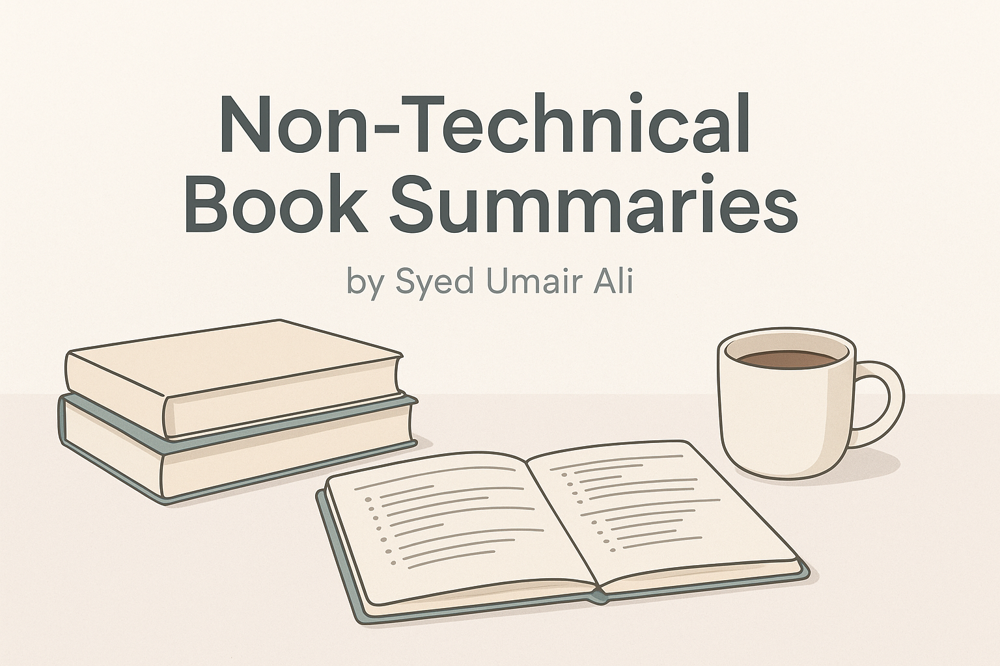

# Book Summaries

Welcome to my personal collection of non-technical book summaries — a growing library of insights and takeaways from the books I've read on productivity, creativity, mindset, and personal development.

Each summary is written in my own words, reflecting what I found most valuable, practical, or thought-provoking. These notes help me retain what I read — and I hope they help you too.

> [!IMPORTANT]
> I focus on clarity over completeness. These are not exhaustive, but instead highlight what stood out to me.

## Why I'm Doing This

Writing summaries helps me think deeper and remember better.
This repo serves as:

- My personal learning archive

- A public resource for others interested in these topics

- A way to sharpen my thinking through writing

I'm Syed Umair Ali, a lifelong learner and curious mind.
If you found something useful here, feel free to reach out or follow my work:

- GitHub: [@syedumaircodes](https://github.com/syedumaircodes)

- LinkedIn: [@syedumaircodes](https://linkedin.com/in/syedumaircodes)

- Personal Site: [My Portfolio](https://bit.ly/syedumaircodes)
